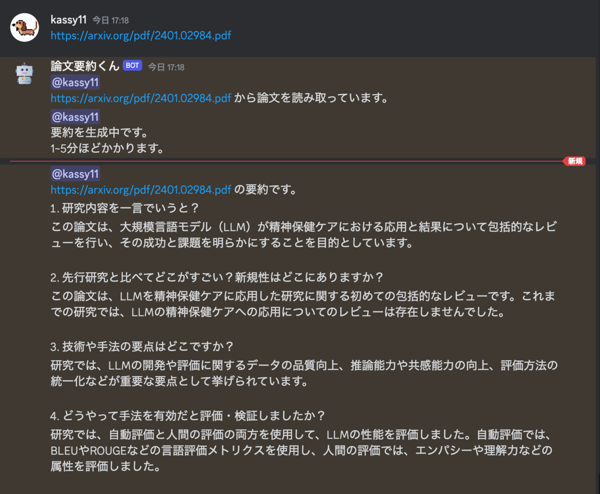

# discord_aper_interpreter

論文PDFを読み取り要約を返してくれるDiscordボット



## 実行方法
- [開発者ポータル](https://discord.com/developers/applications)からDiscordボットを新規作成し、Discordトークンを得る
  - 参考：[Botを作る - discordpy-japan](https://scrapbox.io/discordpy-japan/Bot%E3%82%92%E4%BD%9C%E3%82%8B)
- `.env`ファイルを作成し環境変数を格納する
  - MODELは`GPT3`か`GPT4`を選択
```.env
OPEN_AI_API_KEY=xxxxx
MODEL=GPT3
DISCORD_BOT_TOKEN=xxxxx
```
- `docker compose up`でボットを起動する
- ボット宛てに、論文PDFのURLもしくはローカルのPDFをアップロードすると、要約が返ってくる

## 要約形式
- `format.txt`の形式で論文が要約されます.

## 注意事項
論文全文を読み取り、トークン数の多いChatGPTモデルに入力しています.

利用料金には十分気を付けてください.
